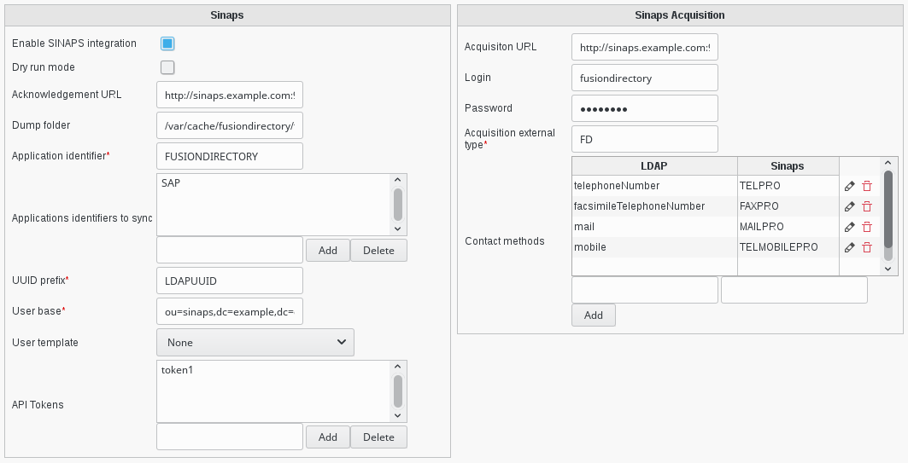

Configuration
=============

Basic configuration
-------------------

* **Enable SINAPS integration**: This can be unchecked if you need to deactivate SINAPS integration for some time, or before you finished configuration for instance.
* **Dry run mode**: Can be used for tests, this deactivates sinaps integration but still dumps XML received and what would be send in the dump folder.
* **Dump folder**: If this is set to a directory path, all messages sent to or received from sinaps will be dumped here. Can be useful for debugging.
* **Application identifier**: String that identifies this FusionDirectory instance in Sinaps. This what will be looked for in cross references.
* **Applications identifiers to sync**: Identifiers of other applications for which we want to store cross references in supannRefId field.
* **UUID prefix**: The prefix you want to be added before the UUID in the supannRefId field.
* **User base**: The base in which users created by sinaps will be stored.
* **User template**: The template to use for creating such users.
* **API Tokens**: A list of valid API tokens to be accepted by the sinaps end point. You can put what you want in here, but using long strings generated by cryptographically strong random sources is better.

Acquisition configuration
-------------------------
* **Acquisiton URL**: The URL for the acquisition end point of Sinaps
* **Login**: The login to use to contact this end point
* **Password**: The password to use
* **Acquisition external type**: The string that will be put in typeExterne tag in the XML
* **Contact methods**: Which LDAP fields to be send for acquisition, and as which Sinaps contact method
