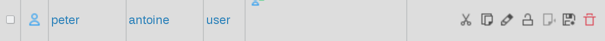
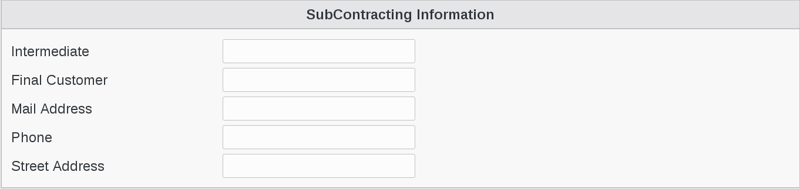

.. include:: /globals.rst

Functionalities
===============

* Create a subcontracting user

In FusionDirectory, click on Users icon

.. image:: images/subcontracting-users.png
   :alt: Picture of Users icon in FusionDirectory

Select a user

Go to Subcontracting tab

Click on "Add Subcontracting settings" button 

.. image:: images/subcontracting-settings.png
   :alt: Picture of Add Subcontracting settings in FusionDirectory
   
Fill-in SubContracting Information   

Click on Apply button bottom right to save your settings   

Now, on your user profile line you can see the Subcontracting icon   

