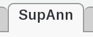
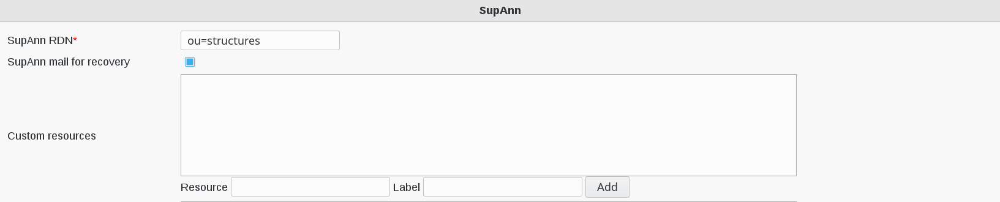
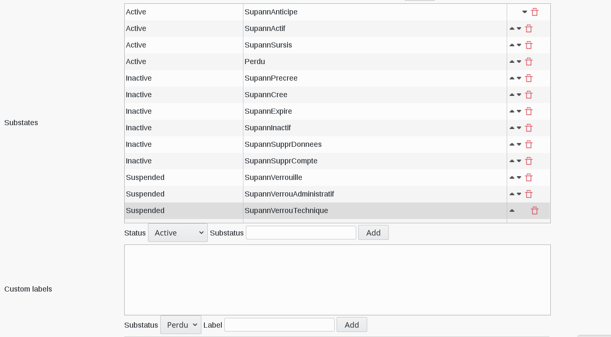
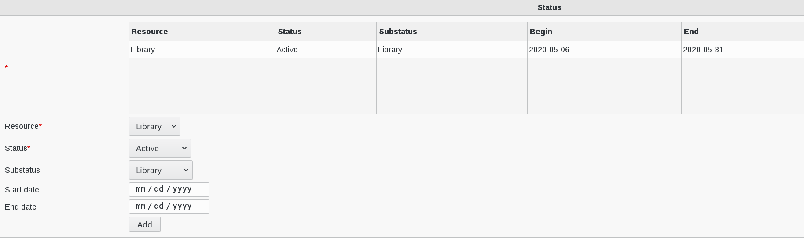

Configuration
=============

The SupAnn standard specifies how to fill cn attribute: https://services.renater.fr/documentation/supann/supann2018/recommandations2018/attributs/cn

You can change how FusionDirectory fill cn attribute by modifying CN Pattern by **%t[fr_FR]|sn% %t[fr_FR]|givenName%** in the configuration backend :ref:`configuration_people_and_group_storage`

Configure SupAnn Status
^^^^^^^^^^^^^^^^^^^^^^^

Click on Configuration icon on FusionDirectory main page

Go to SupAnn tab

Click on Edit button bottom right

   
* **SupAnn RDN** : branch in which SupAnn structures will be stored (required)
* **SupAnn mail for recovery** : allow the use of mail addresses from the personal mail address field from SupAnn account for password recovery
* **Custom resources** : custom resources and thei labels

For example : if you want to add a label resources for the library, fill-in the following fields as showned and click "add" 

   
* **Substates** : allowed substates for an account. There are three substates type : Active, Inactive and Suspended
* **Custom labels** : labels for cutsom substates   

For Example, you can add the ressource Library having substatus "Perdu", lost

When you are done, click on OK button bottom right

.. image:: images/supann-ok-button.png
   :alt: Picture of OK button in FusionDirectory
   
Now, in order to see if your settings have been correctly added to a user, go to user SupAnn status tab.

On **Resource** drop-down menu you have now a "Library" entry

On **Substatus**  drop-down menu you have now a "Library" entry

   

Configure Multiservice card
^^^^^^^^^^^^^^^^^^^^^^^^^^^

Here is the wiew of Multiservice Card settings to configure

.. image:: images/supann-multiservice-card-settings_1.png
   :alt: Picture of Multiservice Card settings in FusionDirectory
   
.. image:: images/supann-multiservice-card-settings_2.png
   :alt: Picture of Multiservice Card settings in FusionDirectory
   
* **Card types** : card types and their labels. Please, prefix with {ORIGIN} for non standard types
* **Card sources** : multi service card possible sources, with format system@domain
* **Card formats** : allowed formats for multiservice cards      
* **Card application domains** : domains for card applications
