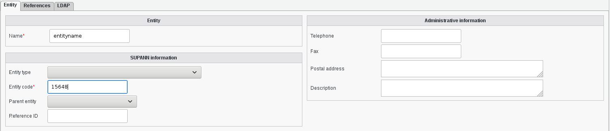
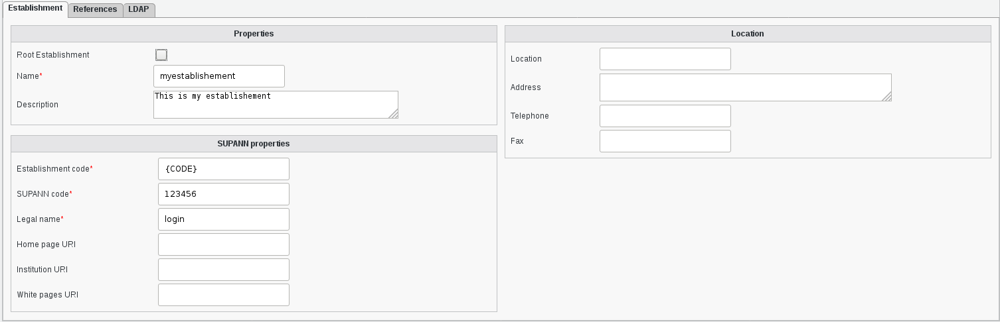
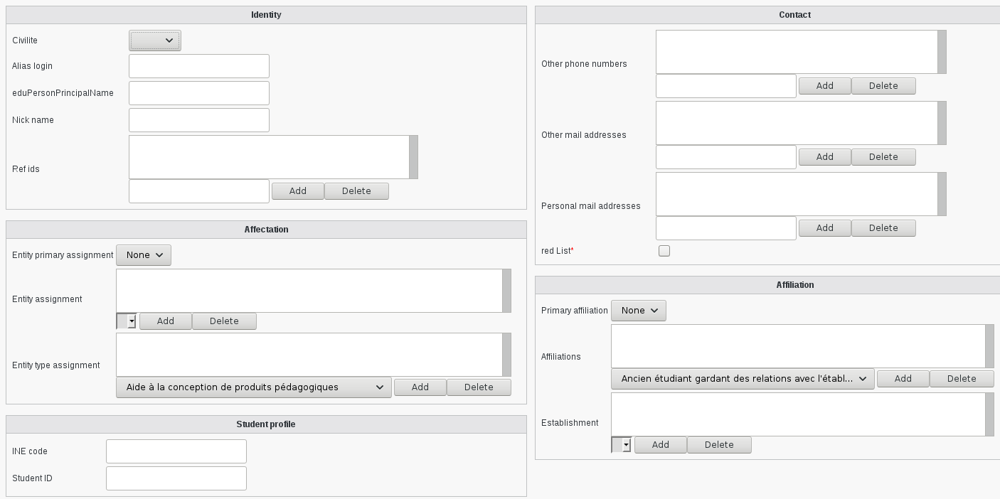
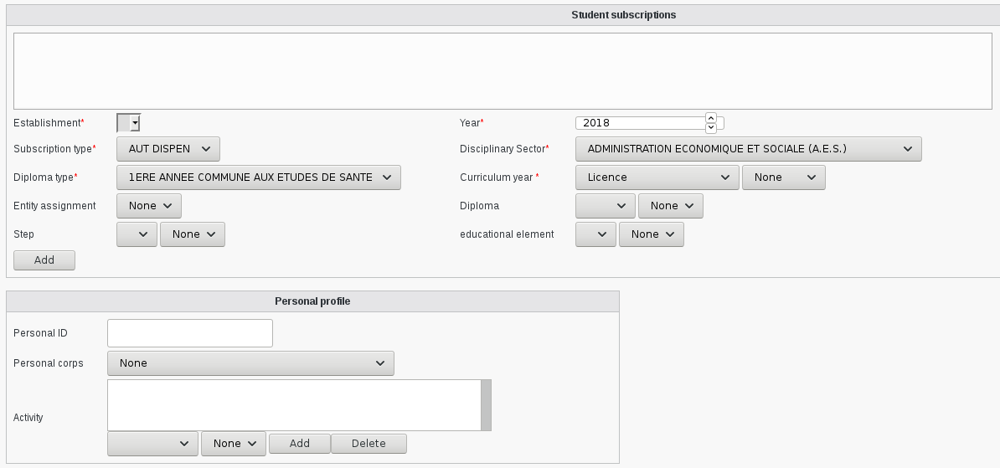
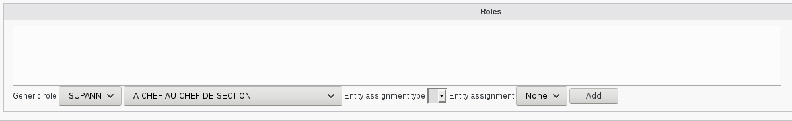
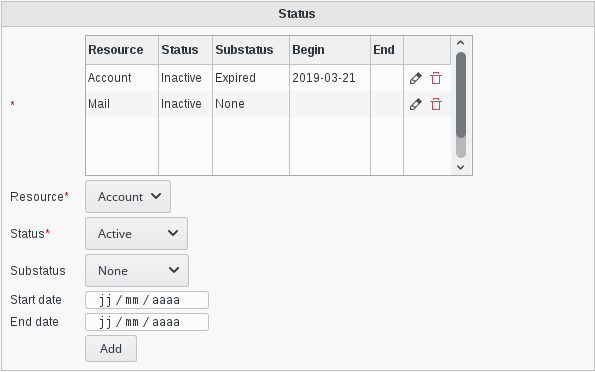

.. include:: ../../globals.rst

Multiservice card
=================

* Create an entity

* Create an establishement

* Create an user with supann informations

How use custom lists
^^^^^^^^^^^^^^^^^^^^

For some attributes like diplome you can extend them with a custom file in /etc/fusiondirectory/supann/

This process work for the following attributes:

*   supannTypeEntiteAffectation (entite) only from FD 1.3
*   supannEtuDiplome_diplome (diplome)
*   supannEtuEtape (etuetape is default empty)
*   supannEtuElementPedagogique (etuelementpedagogique is default empty)
*   supannActivite (activite)
*   supannRoleGenerique (role)

You need to do the following to make it work.

*   Add a file like |file| diplome_CUSTOM in |folder| /etc/fusiondirectory/supann/
*   Fill your file with your customs entries

In FusionDirectory you will need to select your "CUSTOM" part before selecting your entry that are in your file

SupAnn Status
^^^^^^^^^^^^^

The plugin also adds a tab on users to see/set the current state of their resources.
Default available resources are the mail account and the account itself.

You can also set the start date and end date of the current status for a resource.

If you set an end date, you either have to change the status yourself or use our tool **argonaut-user-reminder** with the option **--supann-update**. 

**argonaut-user-reminder** should run daily to keep the status consistent.
