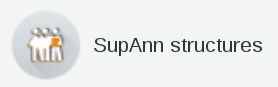
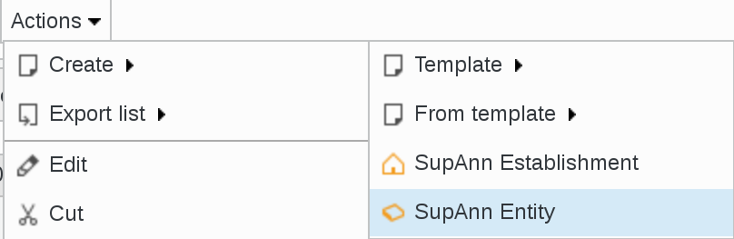
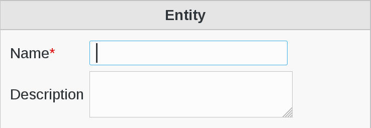
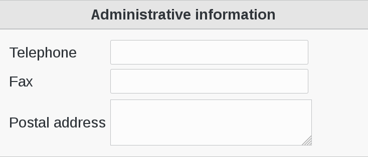
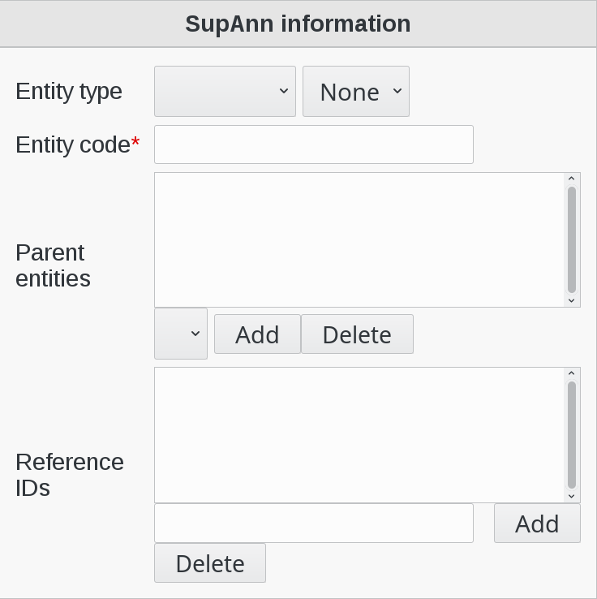
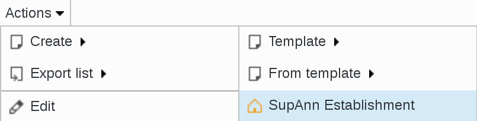
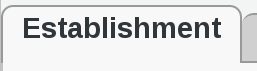
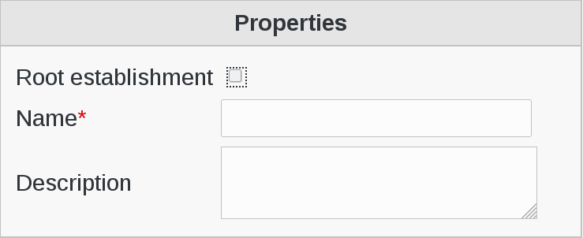
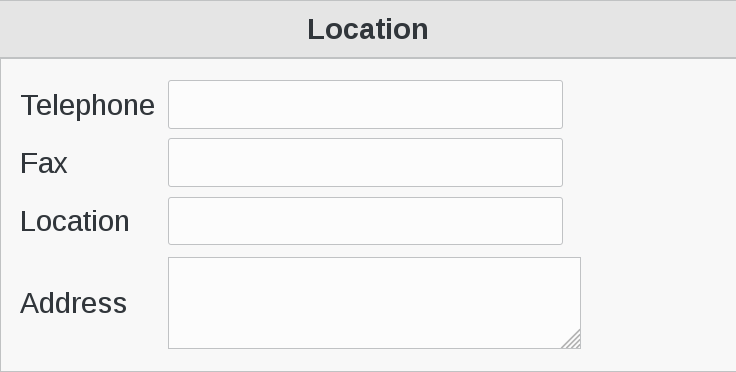
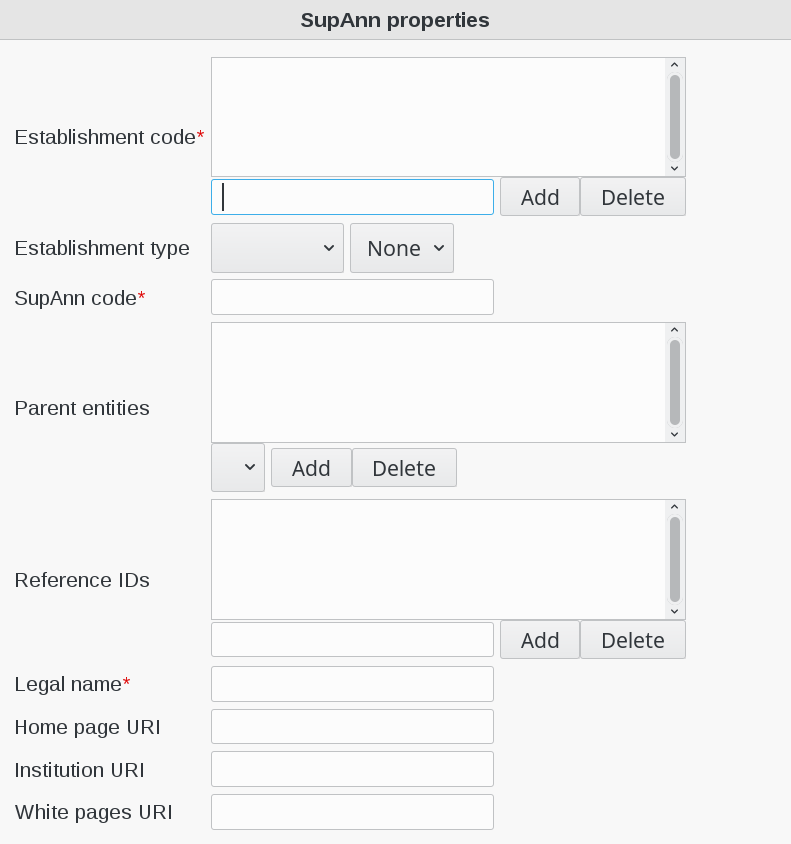

.. include:: ../../globals.rst

Structures
==========

Create an entity
^^^^^^^^^^^^^^^^

Click on SupAnn Structures icon in FusionDirectory main page

   
Click on Actions --> Create > Supann Entity

   
Go to Entity tab

    

   
Fill-in the following fields :

* **Name** : the name to write in the ou attribute for this entity (required)
* **Description** : short description of this entity

   
Fill-in the following fields :

* **Telephone** : phone number of this entity
* **Fax** : fax number of this entity
* **Postal address** : postal address of this entity

   
Fill-in the following fields :

* **Entity type** : the SupAnn type that best fits this entity 
* **Entity code** : the SupAnn code of this entity (required)
* **Parent entities** : the parent entries of this entity
* **Reference IDs** : supannRefId - IDs/links for this entity on other systems

Click on OK button bottom right to save your settings

.. image:: images/supann-ok-button.png
   :alt: Picture of OK button in FusionDirectory    
   

Create an establishement
^^^^^^^^^^^^^^^^^^^^^^^^

Back on SupAnn structures page, click on Actions --> Create > Supann Establishment

Go to Establishment tab

   

      
Fill-in the following fields :

* **Root establishment** : see this establishment as the root one
* **Name** : the name to write in the o attribute for this establishment (required)
* **Description** : a short description of this establishment
  

   
Fill-in the following fields :

* **Telephone** : phone number of this establishment
* **Fax** : fax number of this establishment
* **Location** : usually the city where this establishment is situated
* **Address** : the postal address of this establishment  

   
Fill-in the following fields :

* **Establishment code** : the code of this establishment (must have a prefix between {}) (required)
* **Establishment type** : the SupAnn type that best fits this Establishment
* **SupAnn code** : the SupAnn code for this establishment (required)
* **Parent entities** : the parent entities of this entity
* **Reference IDs** : supannRefId - IDs/links for this entity on other systems
* **Legal name** : the legal name of this establishment (required)
* **Home page URI** : the URI of this establishment website home page
* **Institution URI** : the URI of this establishment institution website
* **White pages URI** : the URI of this establishment white pages    
