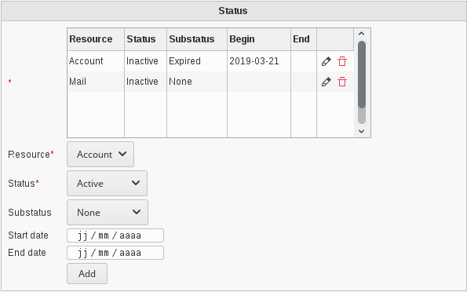

.. include:: ../../globals.rst

SupAnn Status
=============

The plugin also adds a tab on users to see/set the current state of their resources.
Default available resources are the mail account and the account itself.

You can also set the start date and end date of the current status for a resource.

If you set an end date, you either have to change the status yourself or use our tool **argonaut-user-reminder** with the option **--supann-update**. 

**argonaut-user-reminder** should run daily to keep the status consistent.
