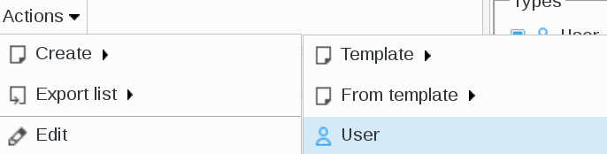
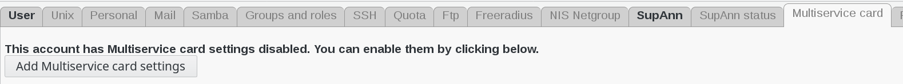
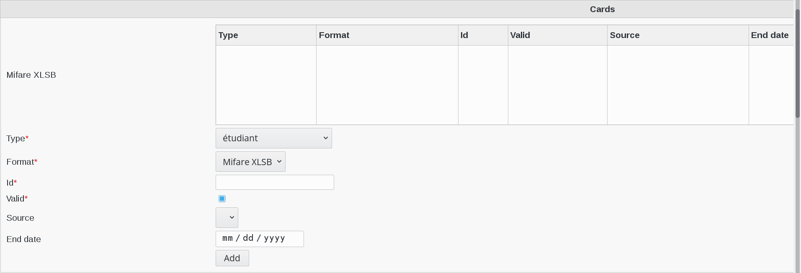
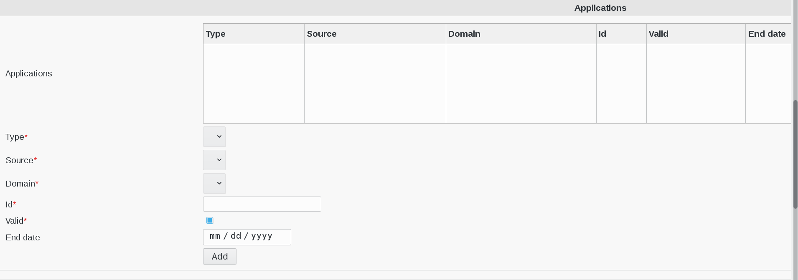

.. include:: ../../../globals.rst

SupAnn Multiservice card
========================

Click on Users icon on FusionDirectory main page

   
Click on Actions --> Create --> User

   
Go to SupAnn tab anc click on "Add SupAnn settings" button

Go to MUltiservice card tab anc click on "Add MUltiservice card settings" button

   
Cards

   
Fill-in the following fields :

* **Mifare XLSB** : SupAnn CMS Affectation 
* **Type** : supannCMSType - Card type (required)
* **Format** : card format (required)
* **Id** : card id (required)
* **Valid** : card validity (required)
* **Source** : card managing system and establishment
* **End date** : end of validity date, if any

Applications

Fill-in the following fields :

* **Applications** : supann CMS Application Affectation
* **Type** : supannCMSType - Card type (required)
* **Source** : Card managing system and establishment (required)   
* **Domain** : applicatioj domain (required)
* **Id** : application id (required)
* **Valid** : application validity (required)
* **End date** : end of validity date, if any

When you are finished, click on "OK" button bottom right

