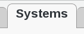
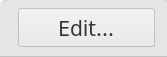
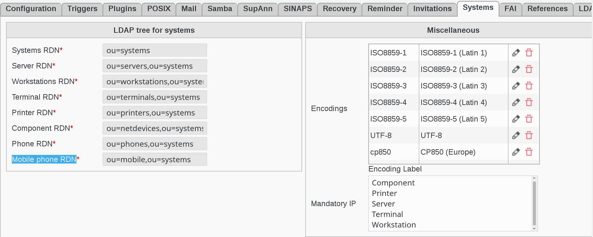

Configuration
=============

Click on Configuration icon in FusionDirectory main page

.. image:: images/systems-configuration-main.png
   :alt: Picture of Configuration button in FusionDirectory
   
Go to Systems tab

   
Click Edit button bottom right in order to set your Systems data  

   
Here are the systems configuration entries 

   
Fill-in the follwing fields :

* **Systems RDN** : branch in which systems will be stored (required)
* **Server RDN** : branch in which servers will be stored (required)
* **Workstations RDN** : branch in which workstations will be stored (required)
* **Terminal RDN** : branch in which terminals will be stored (required)
* **Printer RDN** : branch in which printers will be stored (required)    
* **Component RDN** : branch in which network devices will be stored (required)      
* **Phone RDN**  : branch in which phones will be stored (required)   
* **Mobile phone RDN** : branch in which mobile phones will be stored (required)   
* **Encodings** : available encodings for share services
* **Mandatory IP** : objects types for which IP field should be mandatory

