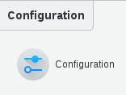
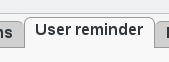
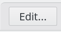
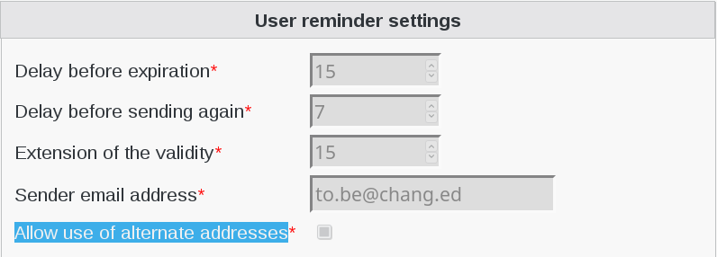
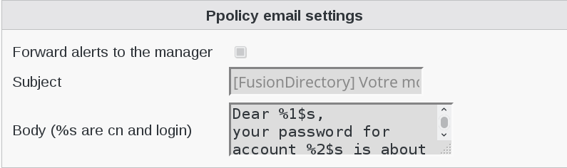
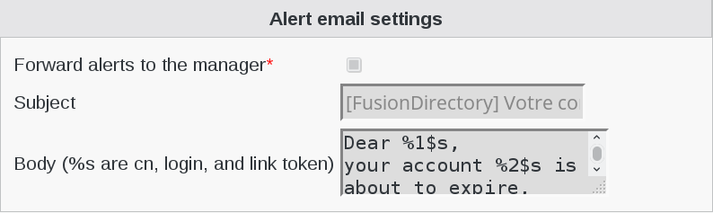
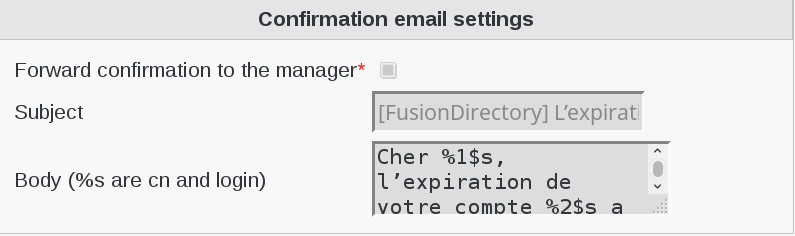
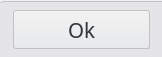

.. include:: /globals.rst

Functionalities
===============

* How to configure User-Reminder plugin

Click on COnfiguration icon in FusionDirectory

Go to User reminder tab

   
Click on the edit button at the bottom right   

   
Fill-in user-reminder settings:

.. code-block:: bash

   Delay before expiration: days before expiration when we send the email
   Delay before sending again: days before sending a second email
   Extension of the validity: number of days for the postpone
   Sender email address: sender e-mail address
   Allow use of alternate addresses: thick this box if needed
    
Fill-in Ppolicy email settings:

.. code-block:: bash

   Forward alerts to the manager : thick to send alert to manager
   Subject : subject of the e-mail
   Body (%s are cn and login) : content of the e-mail
    
Fill-in Alert email settings:

.. code-block:: bash

   Forward alerts to the manager : thick to send alert to manager
   Subject : subject of the e-mail
   Body (%s are cn and login) : content of the e-mail
    
Fill-in Confirmation email settings:

.. code-block:: bash

   Forward alerts to the manager : thick to send alert to manager
   Subject : subject of the e-mail
   Body (%s are cn and login) : content of the e-mail
   
Click on "ok" to save your configuration

/!\ Don't forget to add password expiration date in Unix tab. /!\    
