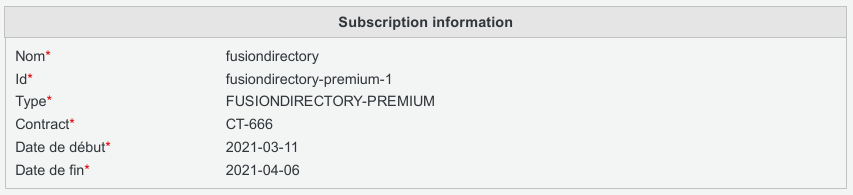

.. _fd-activate-a-subscription-label:

Activate a subscription 
=======================

When buying the subscription you received an .ini file, this file is to activate your subscription in FusionDirectory.

* To activate the subscription got to main menu

   
* Click on subscription

   
* Click the browse button, click on to import the .ini file

* The subscription section should be filed with your subscription information

   
Expired subscription
^^^^^^^^^^^^^^^^^^^^

When you subscription is expired you will see it in the import section

