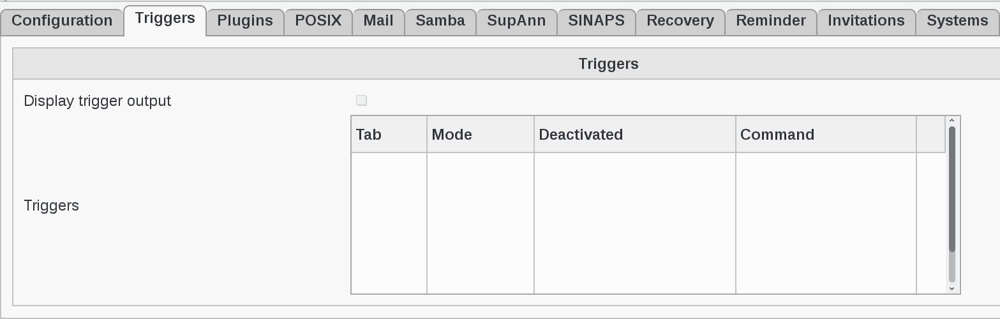

.. include:: /globals.rst

Configuration 
=============

* How you can use a trigger

You can access to triggers management via the 'Configuration' icon or entry in the 'Addons' section of the main page of FusionDirectory

.. image:: images/triggers-configuration.png
   :alt: Picture of Configuration icon in FusionDirectory

Access is read-only. If you need to make changes, then you must press the 'Edit' button at the bottom right of the window.

.. image:: images/triggers-edit-button.png
   :alt: Picture of Edit button in FusionDirectory

In Hooks section you can define all your triggers

* **Hooks** : triggers that are called when specific actions happens
* **Tab** : the tab that this triggers concerns (mandatory)
* **Mode** : when to call this command (required)   
* **Command**: the command that will be called (mandatory)
* **Display hook output** : when enables successful trigger execution output is displayed to the user using a dialog

.. note::

   The arguments are automatically escape and surrounds by quote so you may not use quote in command.

Example 

.. image:: images/triggers-example .png
   :alt: Picture of Edit button in FusionDirectory

The line :

.. code-block:: bash

   check 	sudo /usr/local/sbin/fd-userCheckHookSendMail.sh %dn% %fdPrivateMail% %givenName% %sn% %uid% %callerGIVENNAME% %callerSN% %passwordClear% %nbCheckErrors%

This will generate an automated e-mail like this :

.. code-block:: bash

   Hello bilbo the hobbit,

    Your account hbilbo has been created with password "vegOtNubraw7"

    Please follow the next steps:   

     - Go to https://acme.fusiondirectory.org/
     - Modify your password.
     - Fill your infos if you want
     - You can access the gitlab at https://gitlab.fusiondirectory.org

    Enjoy,

    FusionDirectory's Team

